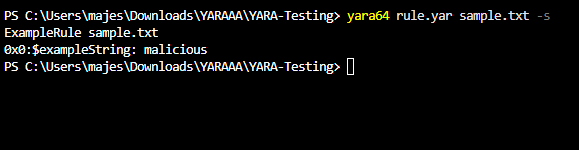
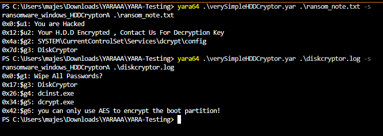
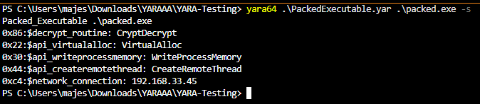
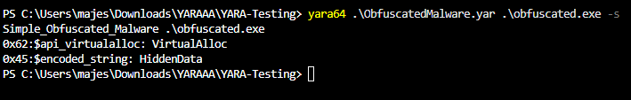

# YARA Basic Manual Guide

A beginner-friendly YARA project containing custom detection rules, sample files, and Proof-of-Concept screenshots for learning malware detection and YARA rule development.

## Overview

This repository demonstrates how YARA can be used to detect:

* Ransomware indicators
* Packed executables
* Basic malware obfuscation techniques
* Suspicious API usage
* Registry paths and malware artifacts
* Encoded and hidden strings

All included samples are harmless and created solely for educational purposes.

---

## Repository Structure

```text
YARA-Testing/
│
├── PoC/
│   ├── Test1.png
│   ├── Test2.png
│   ├── Test3.png
│   └── Test4.png
│
├── verySimpleHDDCryptor.yar
├── PackedExecutable.yar
├── ObfuscatedMalware.yar
│
├── ransom_note.txt
├── diskcryptor.log
├── packed.exe
├── obfuscated.exe
│
├── rule.yar
├── sample.txt
│
├── LICENSE
└── README.md
```

---

## Included Rules

### 1. verySimpleHDDCryptor.yar

A simplified ransomware detection rule inspired by HDDCryptor-style indicators.

Detects:

* Ransom note messages
* DiskCryptor references
* Registry paths
* Encryption-related artifacts
* Executable names associated with the malware

Example condition:

```yara
condition:
    2 of ($u*) or 4 of ($g*)
```

Meaning:

* At least 2 unique indicators must match
* OR
* At least 4 generic indicators must match

---

### 2. PackedExecutable.yar

Demonstrates detection of common artifacts found in packed executables and malware loaders.

Indicators include:

* CryptDecrypt
* VirtualAlloc
* WriteProcessMemory
* SetThreadContext
* CreateRemoteThread
* Network-related strings

These APIs are frequently used during:

* Process injection
* Payload decryption
* Memory allocation
* Shellcode execution

---

### 3. ObfuscatedMalware.yar

Demonstrates basic malware obfuscation detection.

Indicators include:

* HiddenData strings
* VirtualAlloc references
* Anti-debug artifacts
* Control-flow obfuscation patterns

Useful for understanding how malware attempts to conceal functionality.

---

## Sample Files

### ransom_note.txt

A harmless sample ransomware note designed to trigger:

```text
verySimpleHDDCryptor.yar
```

---

### diskcryptor.log

Contains generic HDDCryptor-related indicators used for testing detection logic.

---

### packed.exe

A harmless text-based sample that imitates behavior commonly observed in malware loaders and packed executables.

Contains references such as:

```text
VirtualAlloc
CryptDecrypt
WriteProcessMemory
CreateRemoteThread
```

---

### obfuscated.exe

A harmless sample containing strings associated with simple malware obfuscation techniques.

Contains:

```text
HiddenData
VirtualAlloc
```

---

## Usage

### Scan a File

```bash
yara verySimpleHDDCryptor.yar ransom_note.txt
```

```bash
yara PackedExecutable.yar packed.exe
```

```bash
yara ObfuscatedMalware.yar obfuscated.exe
```

---

### Scan a Directory Recursively

```bash
yara -r verySimpleHDDCryptor.yar .
```

---

### Print Matching Strings

```bash
yara -s verySimpleHDDCryptor.yar ransom_note.txt
```

---

### Display Rule Metadata

```bash
yara -m PackedExecutable.yar packed.exe
```

---

## YARA Concepts Demonstrated

This project showcases several commonly used YARA features:

* Meta information
* String definitions
* ascii
* wide
* nocase
* fullword
* base64
* base64wide
* String grouping
* Wildcard matching
* any of them
* n of ($group*)
* Rule conditions

---

## Proof of Concept

| Rule Creation      | HDDCryptor Detection |
| ------------------ | -------------------- |
|  |    |

| Packed Executable Detection | Obfuscated Malware Detection |
| --------------------------- | ---------------------------- |
|           |            |

---

## Learning Objectives

This repository was created to help beginners understand:

* How YARA rules are structured
* How malware indicators are represented
* How rule conditions work
* How sample files can be tested against custom signatures
* Basic malware hunting concepts

---

## Disclaimer

This repository is intended solely for educational and research purposes.

All files included in this repository are harmless demonstration samples created to test YARA rule behavior and do not contain functional malware.

---

## Author

**Aditya Bhatt**

Cybersecurity Researcher | VAPT Specialist | Malware Analysis Enthusiast

GitHub: https://github.com/AdityaBhatt3010
